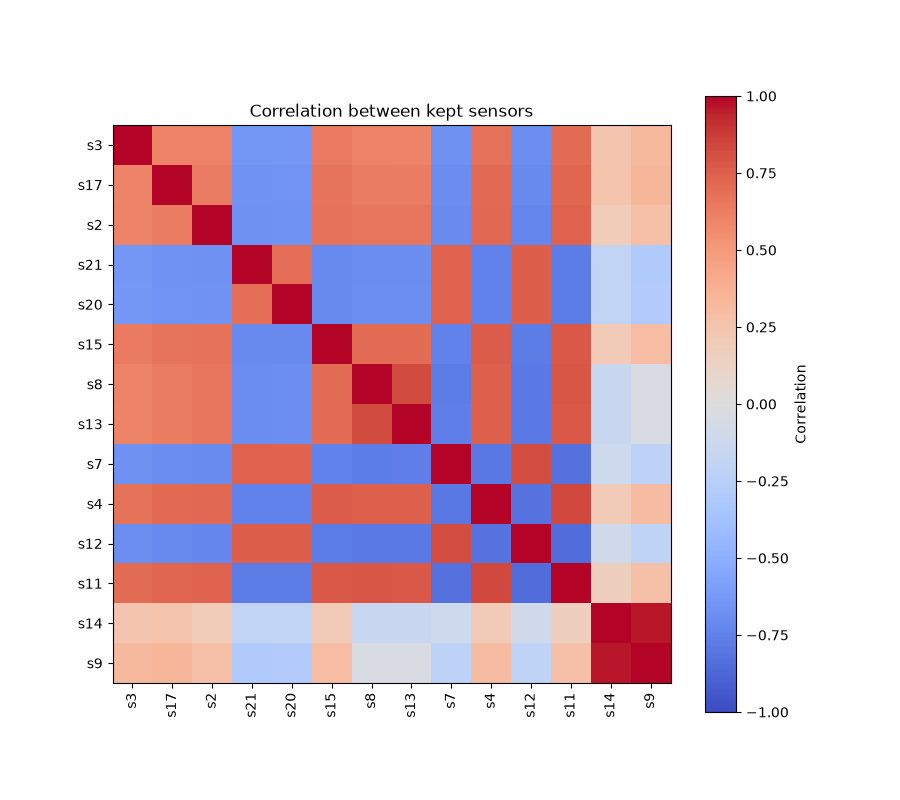
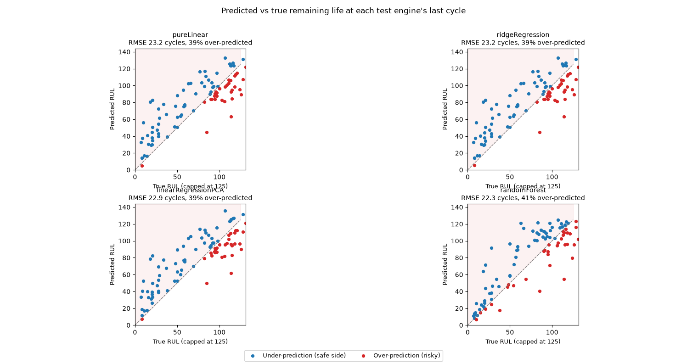

A python data analysis project for the CMAPSS data (https://data.nasa.gov/docs/legacy/CMAPSSData.zip). Aiming to find out what changes in which sensors correlate with engine failure.

I have written several functions in the quality.py file to check for any issues in the existing data and ensure its integrity, including ensuring that the test data and its real results match exactly in length and ids as well as checking that there are no empty rows or duplicate records to unnecessarily bias the analysis.

To filter out columns which may have no major change over any engines lifespan and thus be effectively irrelevant to finding what foreshadows an engine nearing RUL I used the noise_vs_drift function, which analyses which columns actually change over a engines lifespan.

I used the describe function to generate some basic information on the dataset in the form of the following table
,mean,std,min,max,unique,relStd
operational setting1,-0.0,0.0022,-0.0087,0.0087,158,246.5927
operational setting2,0.0,0.0003,-0.0006,0.0006,13,124.6632
operational setting3,100.0,0.0,100.0,100.0,1,0.0
sensor measurement1,518.67,0.0,518.67,518.67,1,0.0
sensor measurement2,642.6809,0.5001,641.21,644.53,310,0.0008
sensor measurement3,1590.5231,6.1311,1571.04,1616.91,3012,0.0039
sensor measurement4,1408.9338,9.0006,1382.25,1441.49,4051,0.0064
sensor measurement5,14.62,0.0,14.62,14.62,1,0.0
sensor measurement6,21.6098,0.0014,21.6,21.61,2,0.0001
sensor measurement7,553.3677,0.8851,549.85,556.06,513,0.0016
sensor measurement8,2388.0967,0.071,2387.9,2388.56,53,0.0
sensor measurement9,9065.2429,22.0829,9021.73,9244.59,6403,0.0024
sensor measurement10,1.3,0.0,1.3,1.3,1,0.0
sensor measurement11,47.5412,0.2671,46.85,48.53,159,0.0056
sensor measurement12,521.4135,0.7376,518.69,523.38,427,0.0014
sensor measurement13,2388.0962,0.0719,2387.88,2388.56,56,0.0
sensor measurement14,8143.7527,19.0762,8099.94,8293.72,6078,0.0023
sensor measurement15,8.4421,0.0375,8.3249,8.5848,1918,0.0044
sensor measurement16,0.03,0.0,0.03,0.03,1,0.0
sensor measurement17,393.2107,1.5488,388.0,400.0,13,0.0039
sensor measurement18,2388.0,0.0,2388.0,2388.0,1,0.0
sensor measurement19,100.0,0.0,100.0,100.0,1,0.0
sensor measurement20,38.8163,0.1807,38.14,39.43,120,0.0047
sensor measurement21,23.2897,0.1083,22.8942,23.6184,4745,0.0046

Due to this information and the folowing gathered from the driftVsNoise function:
operational setting3    0.000000
sensor measurement1     0.000000
sensor measurement19    0.000000
sensor measurement5     0.000000
sensor measurement18    0.000000
sensor measurement16    0.000000
sensor measurement10    0.000000
operational setting2    0.021679
operational setting1    0.056523
sensor measurement6     0.432965
sensor measurement3     3.784618
sensor measurement17    4.166703
sensor measurement2     4.290318
sensor measurement21    4.492123
sensor measurement20    4.821273
sensor measurement15    4.982505
sensor measurement8     5.451500
sensor measurement13    5.595825
sensor measurement7     5.935123
sensor measurement4     6.233772
sensor measurement12    6.777548
sensor measurement11    7.516827
sensor measurement14    9.399881
sensor measurement9     9.660201
I decided to ignore columns 3, 4, 5, 6, 24, 10, 23, 21 and 15 in my model because they are effectively constant and thus would simply waste space in the model. Any changes in them are either random noise or imperceptibly different from random noise. While columns 3 and 4 displayed high relative standard deviation, this was primarily due to their extremely small mean being inordinately effected by minor fluctuations revealed when noise and deviation are compared.

Notably the datasets readme.txt file is inconsistent in it's notation, the second number resets between operational setting 3 and sensor measurement 1 but the final sensor measurement is labelled 26 when it should be 21.

To further see how the different values act as the engine approaches failure I used matplotlib to produce a graph showing it's change. The results of this are shown in the dataMeasurements png file. Notably several datapoints diverge near the end of their lives, sensors 14 and 9, where some engines spike and others display a gradual decrease, this will change how they have to be handled if I involve them in my regression algorithm.

Some of the sensors were very close together in pattern, to try and check if this shows a real redundancy that could be removed to speed up later model building and running I made a correlation heat map:

Which clearly shows that variables 9 and 14 have a near correlation, meaning that using more than one of them in the later regression model would be a waste. Sensors 2, 3, 4, 8, 11, 13, 15 and 17 act as a group with a strong positive correlation which we know from the earlier graph means they are all increasing as the engine degrades (8 and 13 being most strongly correlated) whereas sensors 7, 12, 20 and 21 show the opposite behaviour as a group, sensors 9 and 14 continue to be effective outlier columns which only correlate with each other.

I decided to test out several different regression models here to see how they modelled the data differently. I have decided to test the model first using all available data and then using only the last 125 datapoints of each engine, this is to avoid confusing the model with large stretches of very similar data where the engine has yet to degrade, which means no information about how much longer it has left is being signalled. 

I then used several scikit based models (Linear regression, Linear regression with PCA, Ridge Regression and Random forest) to try and predict the remaining turns based on the current turn without sensors 14 and 9 due to their inconsistency. I first used 5-fold cross validation to check the models on only the training data, getting the following data, the std was calculated with ddof=0 but ddof=1 may have been more appropriate given the small sample size:
                 model       mean       std      fold1      fold2      fold3      fold4      fold5
0           pureLinear  22.900115  1.457979  24.993081  22.799043  22.902990  20.445296  23.360163
1      ridgeRegression  22.900086  1.459862  24.997095  22.800665  22.901625  20.442716  23.358331
2  linearRegressionPCA  23.463256  1.534430  25.711958  23.488730  23.392046  20.898307  23.825240
3         randomForest  21.370104  1.171591  22.849805  21.384305  21.779717  19.257756  21.578940
Where each value is in cycles based on RMSE. But later changed the data used to be based on a sliding window average from each row to make random noise less of a factor, producing the following results:
                 model       mean       std      fold1      fold2      fold3      fold4      fold5
0           pureLinear  21.815353  1.409404  23.541025  21.695835  21.773407  19.342875  22.723623
1      ridgeRegression  21.811879  1.410411  23.546326  21.699537  21.778846  19.334829  22.699856
2  linearRegressionPCA  21.884118  1.372321  23.587863  21.919698  21.985938  19.413216  22.513874
3         randomForest  19.949925  1.058288  21.168819  19.493686  20.877858  18.205768  20.003496
Maintaing the gaps between them roughly while showing the biggest improvement on random forest, it is possible I could get better results by using more tree branches or reducing the probability of each column being counted on a split to less than one to make high variance variables less significant but I deemed that beyond the scope of the project.
I then used this on the actual data recieveing:
pureLinear
(0        110.524688
1        121.609198
2        115.315675
3        116.192335
4        117.129130
            ...    
13091     35.872470
13092     35.652495
13093     35.774750
13094     35.566396
13095     29.727031
Name: RUL_pred, Length: 13096, dtype: float64, np.float64(22.34230432083114))
ridgeRegression
(0        110.400754
1        121.584502
2        115.374097
3        116.309909
4        117.270575
            ...    
13091     36.086976
13092     35.807750
13093     35.868852
13094     35.591104
13095     29.773111
Name: RUL_pred, Length: 13096, dtype: float64, np.float64(22.328130978553386))
linearRegressionPCA
(0        109.253170
1        117.589969
2        113.781414
3        117.764622
4        119.955703
            ...    
13091     37.359747
13092     35.771511
13093     34.106520
13094     32.415693
13095     26.461499
Name: RUL_pred, Length: 13096, dtype: float64, np.float64(22.046689382708596))
randomForest
(0        116.618902
1        107.980547
2        113.676363
3        115.437320
4        117.767792
            ...    
13091     23.207168
13092     22.017730
13093     22.144778
13094     21.220939
13095     26.314476
Name: RUL_pred, Length: 13096, dtype: float64, np.float64(21.33261282707132))
Showing a increase of about 0.9 cycles between the average error on training and test data, possibly due to the fact is used only the last value rather than taking a mean over several hundred. randomForest was most strongly effected suggesting it was more accurate near the beginning than the others.

To ensure the differences seen here weren't just flukes of the test set specifically used I checked the difference between real and predicted values over several thousand randomly picked rows and took the minimum and maximum over the middle 95%, this got me the following:
Linear minus RF RMSE: 95% interval 2.07 to 2.51
Which suggests the difference between predictions based on linear and random forest regression have a consistent and significant difference between them, as shown by the difference between max and min varying over only 0.5 cycles for the full run. 

In order to ensure I made the right decision in removing sensors 9 and 14 I decided to run the cross validation with them, to get a clear succinct impression of how they effect prediction accuracy:
                 model       mean       std      fold1      fold2      fold3      fold4      fold5
0           pureLinear  21.727878  1.435905  23.529543  21.542705  21.631661  19.255439  22.680040
1      ridgeRegression  21.722279  1.436952  23.530030  21.542117  21.626127  19.247490  22.665630
2  linearRegressionPCA  21.813138  1.446022  23.683450  21.696062  21.778975  19.300672  22.606530
3         randomForest  19.887668  0.596676  20.761597  19.233564  20.428244  19.447549  19.567388
It seems my initial assertion was wrong given we see a consistent decrease of 0.1 in all RMSE (Though this is too small to necessarily not just be random), what is most interesting however is that the standard deviation of randomForest dropped by nearly 50% indicating a much tighter range of answers produced.

In order to make this data more understandable I decided to use matplot lib to plot it, producing the following graph:

Also showing that the models are primarily flawed near the end of the database